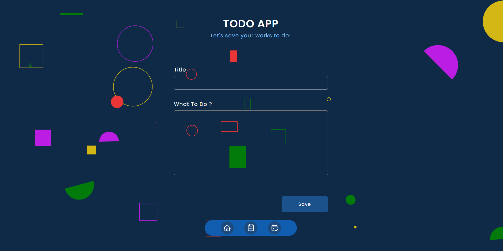
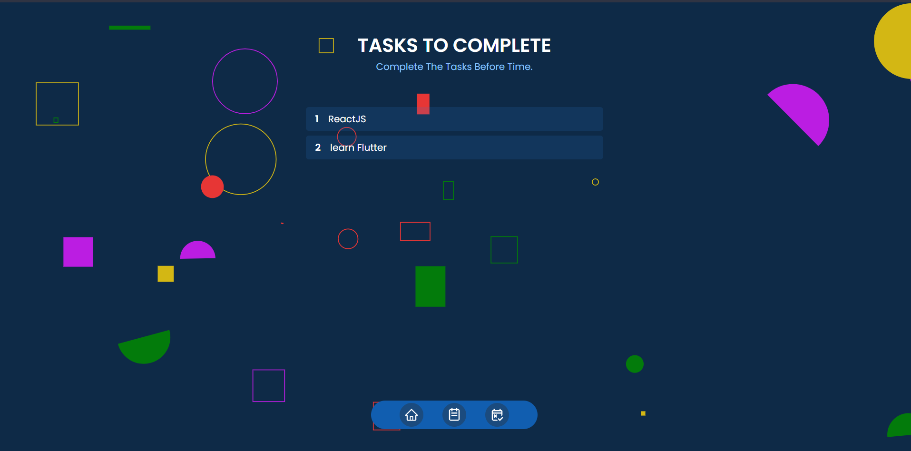
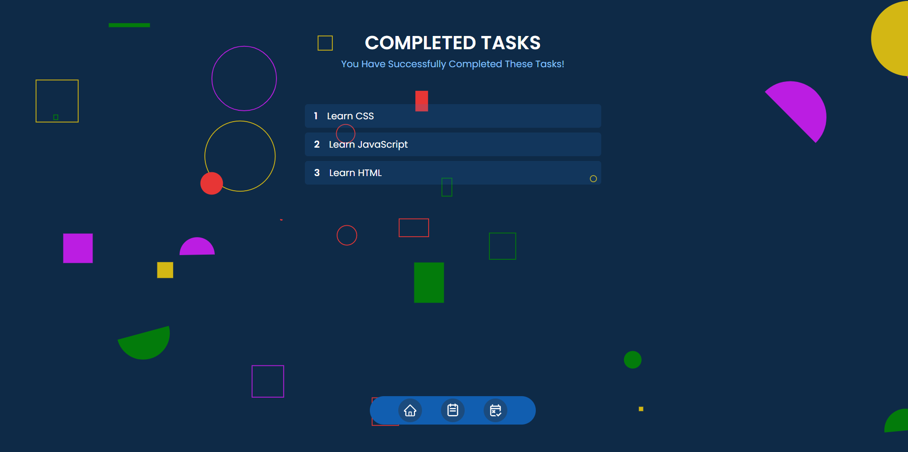
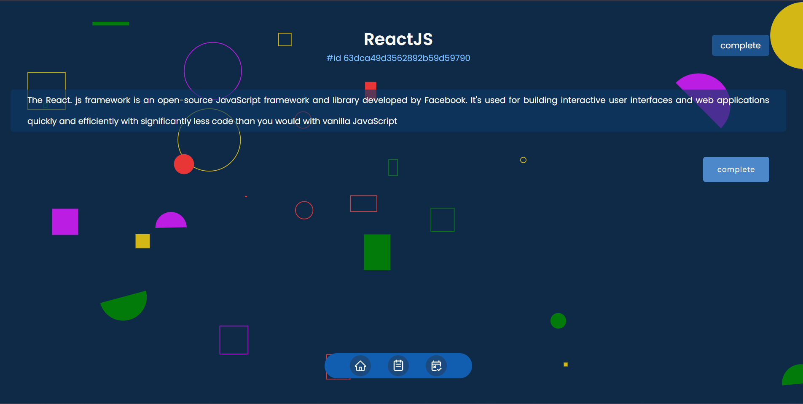
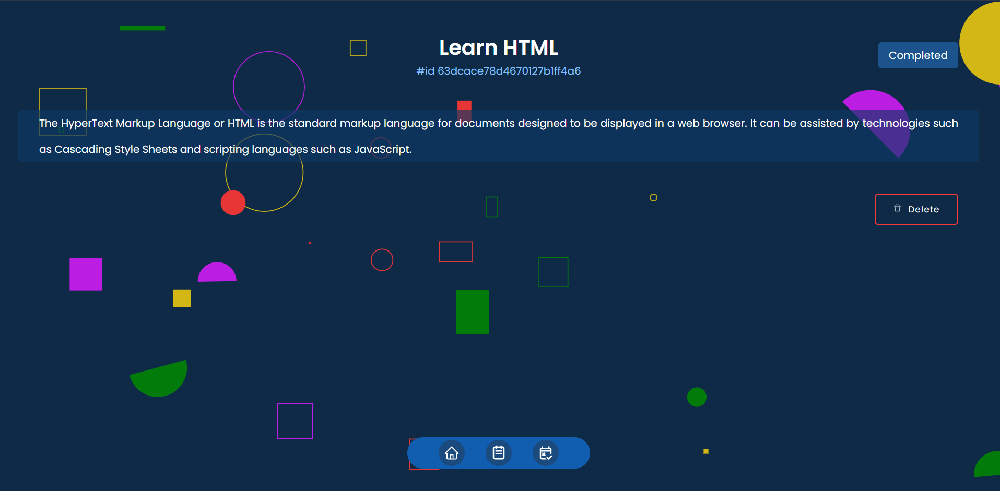

# MERN-Todo-App
Mern stack todo app

Todo App:

Frontend: HTML, CSS, JavaScript, ReactJS

Backend: NodeJS, ExpressJS, MongoDB, Mongoose

Icons Used: React Icons

Example Figures:

Home Page/Add Todo:

Show All Todos To Complete:

Show All Completed Todo:

Show A Specific Todo (not completed):

Show A Specific Completed Todo:

